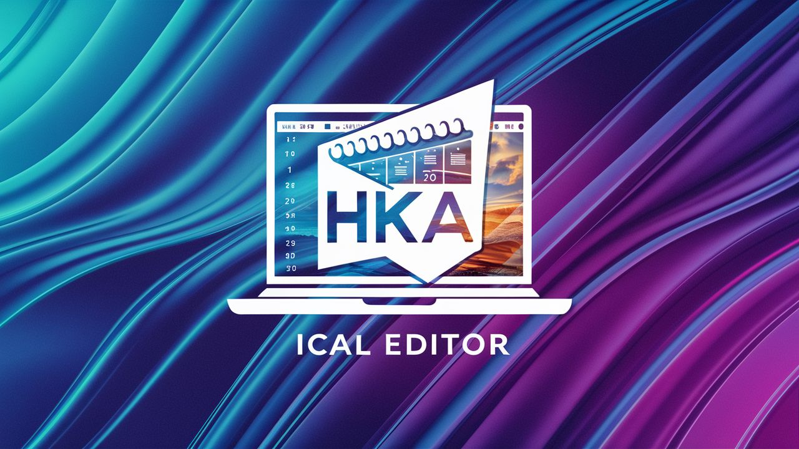

# HKA Timetable iCal Extender
I created this project in order to parse the generated iCal file of my lecture timetable.

It fixes the iCal file so that Google Calendar can read it correctly and adds instructions for Reclaim AI.

You can also merge additional modules to tour timetable and remove given modules from it.
## 🛠️ Technology
I use Java 21, Gradle and Spring Boot.

For parsing and editing the iCal file I use [Biweekly](https://github.com/mangstadt/biweekly), created by Michael Angstadt.
## ⚖️ Terms of use
The license for this project can be found [here](LICENSE).

### 🖼️ Project Image
The project image was created using [Ideogram](https://ideogram.ai).

### 🔗 Third-party Libraries, ...
This project uses several libraries. Please see each projects' terms of use when using the provided code in
this repository.
